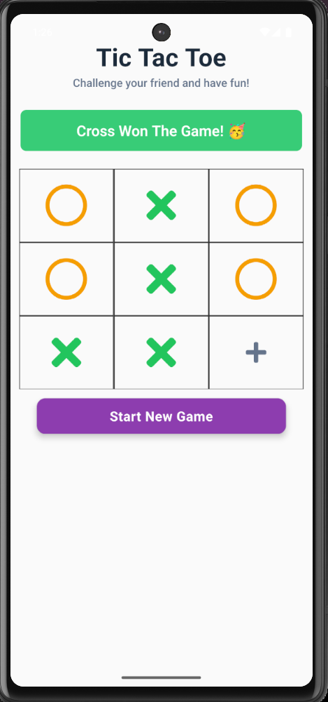

# 🎮 Tic Tac Toe

A modern and interactive **Tic Tac Toe** game built with **React Native** and **TypeScript**. Challenge a friend in a classic 3×3 board game with a clean, responsive interface and smooth gameplay.

<div align="center">
  
</div>


## ✨ Features

- ❌⭕ Two-player turn-based gameplay
- 🏆 Automatic winner detection
- 🤝 Draw detection
- 🔄 One-tap game reset
- 🎨 Clean and responsive UI
- ⚡ Smooth and responsive performance
- 📱 Built with React Native & TypeScript

## 🛠️ Tech Stack

- React Native
- TypeScript
- React Hooks

## 📂 Project Structure

```text
tictactoe/
├── android/
├── ios/
├── images/
│   └── tic.png
├── src/
├── package.json
└── README.md
```

## 🚀 Getting Started

```bash
# Install dependencies
npm install

# Run on Android
npx react-native run-android
```

Enjoy playing Tic Tac Toe! 🎉
